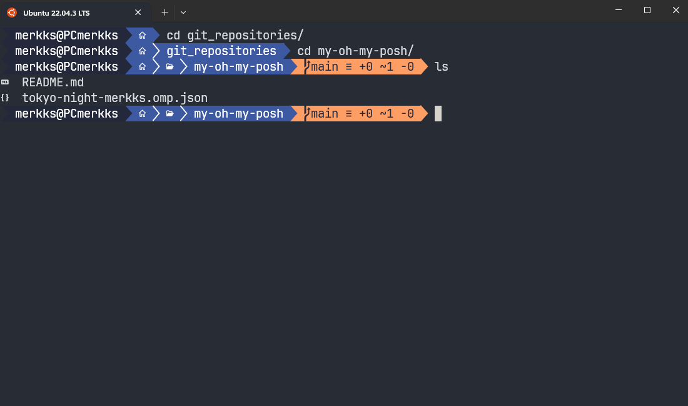
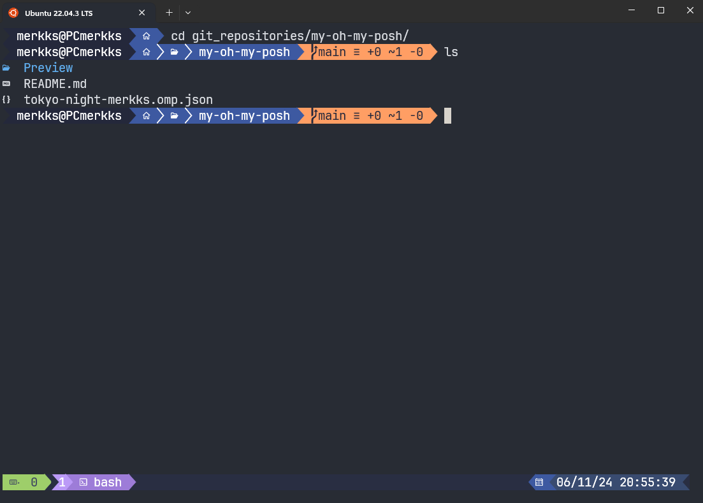

# My Oh-My-Posh Theme

Welcome to my custom `oh-my-posh` theme repository! This repository contains my personalized theme for `oh-my-posh`, a prompt theme engine for any shell. This theme is designed to enhance your terminal experience by providing a visually appealing and informative prompt.

## Tokyo Night Color Palette

The theme uses the Tokyo Night color palette, which provides a dark, soothing, and visually appealing color scheme. This palette is perfect for prolonged use, reducing eye strain and improving readability.

## Preview



Looks nice with [tmux-tokyo-night](https://github.com/fabioluciano/tmux-tokyo-night)



## Installation

### Prerequisites

- Ensure you have `oh-my-posh` installed. You can find installation instructions in the [official oh-my-posh documentation](https://ohmyposh.dev/docs/).

### Clone the Repository

```bash
git clone https://github.com/yourusername/your-repo-name.git
```

### Apply the Theme

1. Copy the theme file to your oh-my-posh themes directory. For example:

```bash
cp your-repo-name/my-custom-theme.json $POSH_THEMES_PATH
```

2. Edit your shell configuration file to use the new theme. For example, add the following line to your .bashrc, .zshrc, or equivalent configuration file:

```bash
eval "$(oh-my-posh init bash --config $POSH_THEMES_PATH/my-custom-theme.json)"
```

3. Reload your shell configuration:

```bash
source ~/.bashrc  # or source ~/.zshrc
```

### Customization

Feel free to customize the theme to your liking. The theme file (tokyo-night-merkks.omp.json) contains various settings for prompt elements such as colors, segments, and symbols. Refer to the oh-my-posh [documentation](https://ohmyposh.dev/docs/) for more information on how to customize your theme.

### Acknowledgements

- [oh-my-posh](https://github.com/JanDeDobbeleer/oh-my-posh) - The prompt theme engine that powers this theme.

- [Tokyo Night](https://github.com/enkia/tokyo-night-vscode-theme) - The color palette inspiration for this theme.

### Links

- [Tokyo Night Palette](https://lospec.com/palette-list/tokyo-night)


